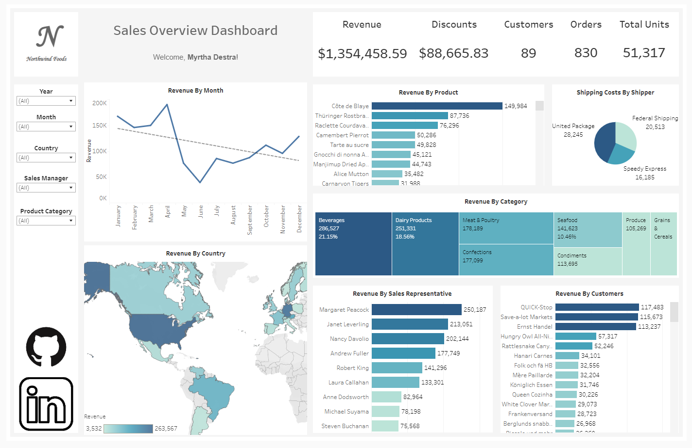

# Northwind Foods Sales Dashboard

Northwind Foods SQL & Tableau Dashboard

This data analytics project focuses on the preparation and visualization of sales data for Northwind Traders, a fictional food supplier. The Maven Analytics’ Northwind Traders Dataset was utilized for this purpose. The dataset encompasses detailed information about sales, orders, customers, products, shippers, and employees.

To begin, I established a SQL database to store the dataset and employed SQL queries to extract valuable insights and address critical business inquiries. A comprehensive sales report was generated using SQL, serving as the foundation for the creation of a visually compelling Tableau dashboard.

The primary objective of this project repository is to provide a clear demonstration of my expertise and proficiency in utilizing Tableau and SQL. 

**[SQL Code](https://github.com/MyrthaDestra/Northwind/blob/main/Northwind%20Traders%20SQL.sql). **

The tableau dashboard is located [here](https://public.tableau.com/app/profile/myrtha.destra/viz/NorthwindFoodsSalesDashboard/SalesOverview).

